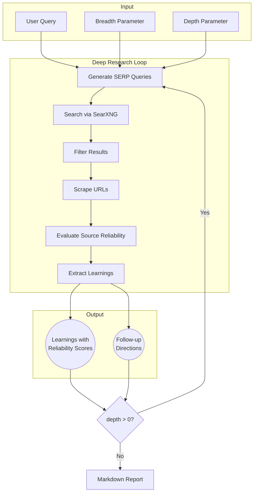

# Web Search MCP

An AI-powered deep research tool exposed as a [Model Context Protocol](https://modelcontextprotocol.io/) (MCP) server. It performs iterative web search, scrapes and evaluates sources, and generates comprehensive research reports with reliability assessments.

## Architecture

The server combines three responsibilities that were previously spread across 5+ services:

1. **Search** — calls [SearXNG](https://github.com/searxng/searxng) (a privacy-respecting metasearch engine) directly via its JSON API
2. **Scrape** — fetches pages with Node's built-in `fetch`, cleans HTML with [cheerio](https://github.com/cheeriojs/cheerio), and converts to Markdown with [Turndown](https://github.com/mixmark-io/turndown)
3. **Research** — uses an LLM (your choice of provider) to generate queries, evaluate source reliability, extract learnings, and write the final report

```
MCP Client (Claude, etc.) --> MCP Server --> SearXNG --> Redis
                                  |
                                  +--> fetch + cheerio + turndown (scraping)
                                  +--> LLM API (reasoning)
```

The full stack deploys as **3 services**: Redis, SearXNG, and this MCP server.

### Inspired by Firecrawl

This project originally used [Firecrawl](https://github.com/mendableai/firecrawl) as middleware between SearXNG and the MCP server. Firecrawl is an excellent open-source web scraping platform, but its full stack (API server, workers, Playwright service, Redis, SearXNG) requires 5+ services to self-host.

We took inspiration from Firecrawl's approach to:
- **Search-then-scrape pipeline** — [Firecrawl's search controller](https://github.com/mendableai/firecrawl/blob/main/apps/api/src/controllers/v1/search.ts) first searches, then scrapes only relevant results
- **HTML-to-Markdown conversion** — Firecrawl converts raw HTML into clean Markdown for LLM consumption, a pattern we replicate with cheerio + Turndown
- **SearXNG as search backend** — Firecrawl's [self-hosted setup](https://github.com/mendableai/firecrawl/blob/main/SELF_HOST.md) uses SearXNG as a free, privacy-respecting search backend with no API key required

By integrating search and scraping directly into the MCP server, we eliminated the Firecrawl dependency while keeping the same patterns that made it effective.

## LLM Provider

The server is **LLM-agnostic**. It uses the [Vercel AI SDK](https://sdk.vercel.ai/) and supports any of these providers:

| Provider | Env Var | Default Model |
|----------|---------|---------------|
| Anthropic | `ANTHROPIC_API_KEY` | `claude-opus-4-5` |
| OpenAI | `OPENAI_API_KEY` | `gpt-5.2` |
| Google | `GOOGLE_API_KEY` | `gemini-3-pro-preview` |
| xAI | `XAI_API_KEY` | `grok-4-1-fast-reasoning` |

The caller selects the model per request via the `model` parameter (e.g. `"anthropic:claude-sonnet-4-5"`). You only need an API key for the provider you use.

LLMs are used for:
- Generating targeted search queries from the research topic
- Filtering search results before scraping (removing junk/spam)
- Evaluating source reliability (scoring 0-1 with reasoning)
- Extracting structured learnings from scraped content
- Writing the final research report

## Quick Start

### 1. Clone and install

```bash
git clone https://github.com/arnaudjnn/web-search-mcp
cd web-search-mcp
pnpm install
```

### 2. Configure environment

```bash
cp .env.example .env.local
```

Edit `.env.local` and add at least one LLM API key:

```bash
ANTHROPIC_API_KEY=sk-ant-...
```

### 3. Start the local stack

```bash
docker compose up -d redis searxng
```

This starts Redis and SearXNG. Then run the MCP server:

```bash
SEARXNG_URL=http://localhost:8080 pnpm run start:http
```

The server is available at `http://localhost:3000/mcp`.

### 4. Or run everything in Docker

```bash
docker compose up
```

## Usage

The server exposes a single MCP tool — **`deep-research`**:

| Parameter | Type | Description |
|-----------|------|-------------|
| `query` | string (required) | The research topic |
| `depth` | 1-5 | How many levels deep to recurse |
| `breadth` | 1-5 | How many parallel queries per level |
| `model` | string (optional) | e.g. `"anthropic:claude-sonnet-4-5"` |
| `tokenBudget` | number (optional) | Soft cap on research-phase tokens |
| `sourcePreferences` | string (optional) | e.g. `"avoid SEO listicles, forums"` |

### Connecting to the Server

All examples below assume your server is running at `https://your-server.up.railway.app/mcp` with an API key. Replace the URL and key with your own values.

#### Claude Code (CLI)

```bash
claude mcp add web-search \
  --transport http \
  https://your-server.up.railway.app/mcp \
  --header "Authorization: Bearer your-api-key"
```

#### Project-level config (`.mcp.json`)

Add to `.mcp.json` at the root of any project to make the tool available to all collaborators:

```json
{
  "mcpServers": {
    "web-search": {
      "type": "http",
      "url": "https://your-server.up.railway.app/mcp",
      "headers": {
        "Authorization": "Bearer your-api-key"
      }
    }
  }
}
```

#### Claude Desktop (`claude_desktop_config.json`)

```json
{
  "mcpServers": {
    "web-search": {
      "type": "http",
      "url": "https://your-server.up.railway.app/mcp",
      "headers": {
        "Authorization": "Bearer your-api-key"
      }
    }
  }
}
```


## How It Works



At each depth level, the server:
1. Generates targeted search queries using the LLM
2. Searches via SearXNG (deduplicates across engines)
3. Filters out junk URLs before scraping
4. Scrapes and converts pages to Markdown
5. Evaluates each source's reliability (0-1 score)
6. Extracts learnings weighted by source reliability
7. Generates follow-up questions for the next depth level

The final report includes all learnings and a sources section sorted by reliability score.

## Deployment (Railway)

[](https://railway.com/new/template?template=https://github.com/arnaudjnn/web-search-mcp&referralCode=arnaudjnn)

Click the button, add your `ANTHROPIC_API_KEY` (or another LLM provider key) during configuration, and hit **Deploy**. Railway provisions all 3 services (Redis, SearXNG, MCP Server) and wires them together automatically.

## Securing the MCP Endpoint

Set the `API_KEY` environment variable to require authentication on all requests (except `/health`). Clients provide the key as a `Bearer` token in the `Authorization` header (shown in the examples above) or as an `?api_key=` query parameter.

If `API_KEY` is not set, the server accepts all requests without authentication.

### Observability (Optional)

Track research flows with [Langfuse](https://langfuse.com/):

```bash
LANGFUSE_PUBLIC_KEY=pk-...
LANGFUSE_SECRET_KEY=sk-...
LANGFUSE_BASEURL=https://cloud.langfuse.com
```

## License

MIT
