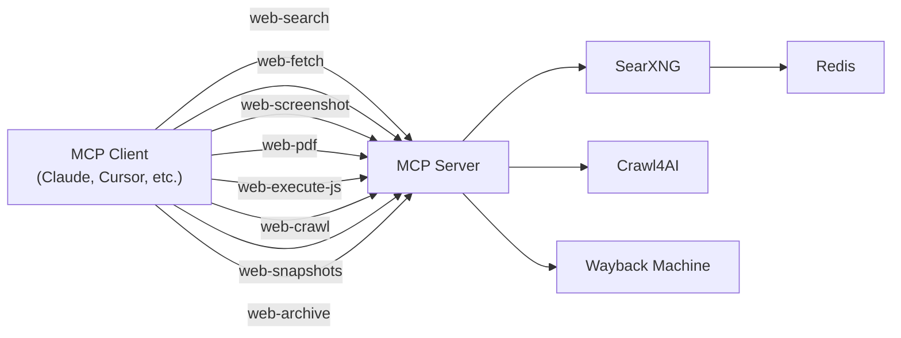

# Web Search MCP

An [MCP](https://modelcontextprotocol.io/) server that provides eight tools: a fast **web search** powered by [SearXNG](https://github.com/searxng/searxng), five [Crawl4AI](https://github.com/unclecode/crawl4ai)-powered tools (**web-fetch**, **web-screenshot**, **web-pdf**, **web-execute-js**, **web-crawl**), and two [Wayback Machine](https://web.archive.org/) tools (**web-snapshots**, **web-archive**).

## Architecture



The `web-search` tool queries SearXNG for search results. The Crawl4AI tools handle content extraction, screenshots, PDFs, JS execution, and multi-URL crawling. The Wayback Machine tools list and retrieve archived pages.

The full stack deploys as **4 services**: Redis, SearXNG, Crawl4AI, and this MCP server.

## Tools

The server exposes eight MCP tools:

### `web-search`

Lightweight web search via SearXNG. Returns structured results.

| Parameter | Type              | Description                                  |
| --------- | ----------------- | -------------------------------------------- |
| `query`   | string (required) | The search query                             |
| `limit`   | number (optional) | Max results to return (default: 10, max: 20) |

Returns a JSON array of `{ url, title, description }` results.

### `web-fetch`

Fetch a single URL and return its content as clean markdown via Crawl4AI.

| Parameter | Type              | Description                                                              |
| --------- | ----------------- | ------------------------------------------------------------------------ |
| `url`     | string (required) | URL to fetch                                                             |
| `f`       | enum (optional)   | Content-filter strategy: `raw`, `fit`, `bm25`, or `llm` (default: `fit`) |
| `q`       | string (optional) | Query string for BM25/LLM filters                                        |

Returns the page content as markdown.

### `web-screenshot`

Capture a full-page PNG screenshot of a URL via Crawl4AI.

| Parameter             | Type              | Description                                 |
| --------------------- | ----------------- | ------------------------------------------- |
| `url`                 | string (required) | URL to screenshot                           |
| `screenshot_wait_for` | number (optional) | Seconds to wait before capture (default: 2) |

Returns a base64-encoded PNG image.

### `web-pdf`

Generate a PDF document of a URL via Crawl4AI.

| Parameter | Type              | Description           |
| --------- | ----------------- | --------------------- |
| `url`     | string (required) | URL to convert to PDF |

Returns a base64-encoded PDF.

### `web-execute-js`

Execute JavaScript snippets on a URL via Crawl4AI and return the full crawl result.

| Parameter | Type                | Description                                     |
| --------- | ------------------- | ----------------------------------------------- |
| `url`     | string (required)   | URL to execute scripts on                       |
| `scripts` | string[] (required) | List of JavaScript snippets to execute in order |

Returns the full CrawlResult JSON including markdown, links, media, and JS execution results.

### `web-crawl`

Crawl one or more URLs and extract their content using Crawl4AI.

| Parameter        | Type                | Description                    |
| ---------------- | ------------------- | ------------------------------ |
| `urls`           | string[] (required) | List of URLs to crawl          |
| `browser_config` | object (optional)   | Crawl4AI browser configuration |
| `crawler_config` | object (optional)   | Crawl4AI crawler configuration |

Returns the extracted content from each URL.

### `web-snapshots`

List Wayback Machine snapshots for a URL.

| Parameter    | Type              | Description                                                             |
| ------------ | ----------------- | ----------------------------------------------------------------------- |
| `url`        | string (required) | URL to check for snapshots                                              |
| `from`       | string (optional) | Start date in YYYYMMDD format                                           |
| `to`         | string (optional) | End date in YYYYMMDD format                                             |
| `limit`      | number (optional) | Max number of snapshots to return (default: 100)                        |
| `match_type` | enum (optional)   | URL matching: `exact`, `prefix`, `host`, or `domain` (default: `exact`) |

Returns a JSON array of snapshots with timestamps, status codes, and archive URLs.

### `web-archive`

Retrieve an archived page from the Wayback Machine.

| Parameter   | Type               | Description                                                          |
| ----------- | ------------------ | -------------------------------------------------------------------- |
| `url`       | string (required)  | URL of the page to retrieve                                          |
| `timestamp` | string (required)  | Timestamp in YYYYMMDDHHMMSS format                                   |
| `original`  | boolean (optional) | Get original content without Wayback Machine banner (default: false) |

Returns the archived page content.

### Connecting to the Server

All examples below assume your server is running at `https://your-server.up.railway.app/mcp` with an API key. Replace the URL and key with your own values.

#### Claude Code (CLI)

```bash
claude mcp add web-search \
  --transport http \
  https://your-server.up.railway.app/mcp \
  --header "Authorization: Bearer your-api-key"
```

#### Project-level config (`.mcp.json`)

Add to `.mcp.json` at the root of any project to make the tool available to all collaborators:

```json
{
  "mcpServers": {
    "web-search": {
      "type": "http",
      "url": "https://your-server.up.railway.app/mcp",
      "headers": {
        "Authorization": "Bearer your-api-key"
      }
    }
  }
}
```

#### Claude Desktop (`claude_desktop_config.json`)

```json
{
  "mcpServers": {
    "web-search": {
      "type": "http",
      "url": "https://your-server.up.railway.app/mcp",
      "headers": {
        "Authorization": "Bearer your-api-key"
      }
    }
  }
}
```

### Replace Claude Code's Built-in Web Search & Web Fetch (Optional)

By default, Claude Code uses its own `WebSearch` and `WebFetch` tools. You can replace them with this server's `web-search` and `web-fetch` tools for privacy-respecting, self-hosted results.

**1. Add the MCP server globally:**

```bash
claude mcp add web-search --scope user \
  --transport http \
  https://your-server.up.railway.app/mcp \
  --header "Authorization: Bearer your-api-key"
```

**2. Disable the built-in tools** by editing `~/.claude/settings.json`:

```json
{
  "permissions": {
    "deny": ["WebSearch", "WebFetch"]
  }
}
```

**3. Guide Claude via `~/.claude/CLAUDE.md`** so it uses your tools:

```markdown
## Search & Fetch

- Use the web-search MCP tool for all web searches
- Use the web-fetch MCP tool to fetch and read web pages
- Do not attempt to use the built-in WebSearch or WebFetch tools
```

**4. Verify** by running `/mcp` inside Claude Code to check the server is connected, then ask Claude to search for something or fetch a URL.

## Deployment (Railway)

[](https://railway.com/deploy/DO6dxz?referralCode=zMTz_F&utm_medium=integration&utm_source=template&utm_campaign=generic)

- Click **Deploy on Railway**: you'll see all 4 services listed (Redis, SearXNG, Crawl4AI, MCP Server)
- Click **Deploy**: Railway provisions everything and wires the services together automatically
- An `API_KEY` is **auto-generated** during deployment. Find it in your MCP Server service's **Variables** tab and use it as your Bearer token

## Quick Start (Local)

### 1. Clone and install

```bash
git clone https://github.com/arnaudjnn/web-search-mcp
cd web-search-mcp
pnpm install
```

### 2. Configure environment

```bash
cp .env.example .env.local
```

### 3. Start the local stack

```bash
docker compose up -d redis searxng crawl4ai
```

This starts Redis, SearXNG, and Crawl4AI. Then run the MCP server:

```bash
SEARXNG_URL=http://localhost:8080 CRAWL4AI_URL=http://localhost:11235 pnpm run start
```

The server is available at `http://localhost:3000/mcp`.

### 4. Or run everything in Docker

```bash
docker compose up
```

## Authentication

The `API_KEY` environment variable is **required**.

On Railway, the key is auto-generated at deploy time (via `${{secret()}}`). For local development, set it in your `.env.local` file.

Clients provide the key as a `Bearer` token in the `Authorization` header (shown in the examples above) or as an `?api_key=` query parameter. The `/health` endpoint is unauthenticated.

## License

MIT
